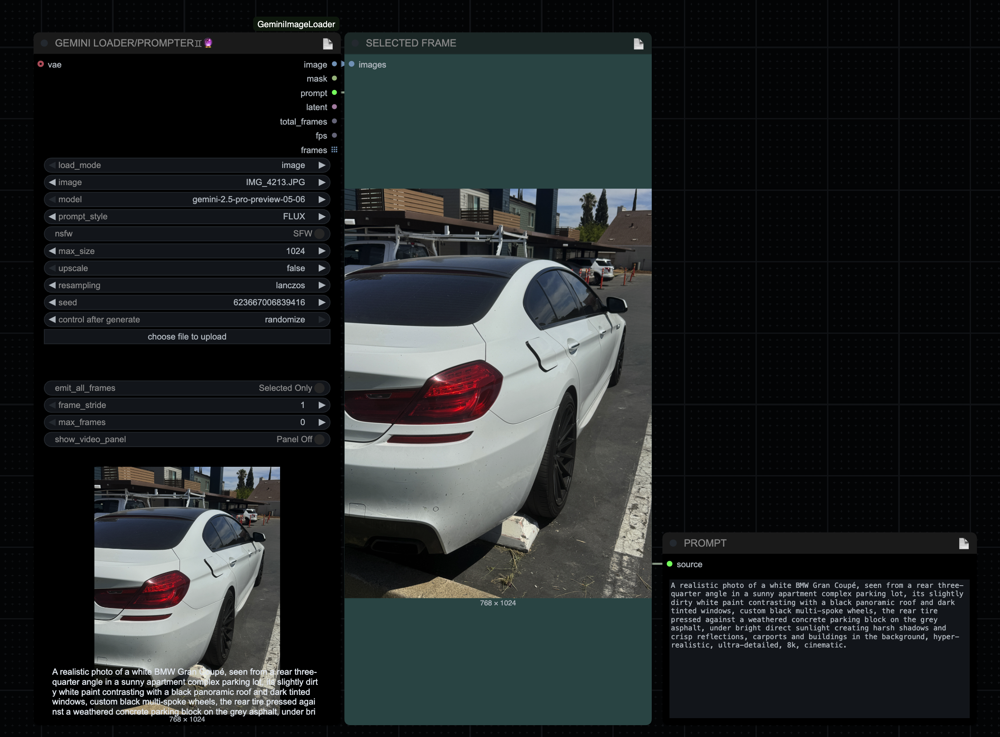

# GEMINI LOADER/PROMPTER♊︎🔮 (ComfyUI)

All‑in‑one media loader and Gemini prompter for images and videos. Load an image or select a video frame, resize cleanly, generate a Gemini‑powered prompt for your target model, and optionally produce a single VAE latent — in one node.

- Image mode: small, crisp preview; clean resize; prompt + single latent.
- Video mode: smooth in‑node preview (matches image preview space), select any frame for processing, get video `fps` and `total_frames`, and optionally output every resized frame when needed.

## ✨ Highlights

- **Dual mode (Image/Video)**: Toggle between image files and video files; select a specific `video_frame` to process.
- **Gemini prompts**: Uses `comfy_api_nodes` to hit Gemini with style presets (PONY, FLUX, 1.5, SDXL) and NSFW/SFW controls.
- **Single latent**: Always encodes exactly one latent (from the selected, resized frame) — never per‑frame latents.
- **Consistent preview**: Video preview fits the same bottom window as images, preserving aspect ratio for clarity.
- **Optional frame export**: Need all frames? Turn it on with stride/limit controls to avoid hangs.
- **Clean resize**: Max‑size clip with selectable resampling (nearest, lanczos, bilinear, bicubic), dimension‑safe (multiples of 8).

## 📸 Examples

Prompts and previews:

- Image mode (Flux): 

- Video mode (selected frame + preview window):
  - SD 1.5: 
  - FLUX: 
  - PONY: 
  - SDXL: 
  - Floating panel on: 

## ⚙️ Installation

1. Navigate to your ComfyUI `custom_nodes` directory.
   ```bash
   cd ComfyUI/custom_nodes/
   ```
2. Clone this repository.
   ```bash
   git clone https://github.com/babydjac/Gemini-Loader-Prompter.git
   ```
3. Install and configure `comfy_api_nodes` (required for Gemini access). See its README for API key configuration.
4. Restart ComfyUI.

## 🔑 API Key & Privacy

- **API key storage**: This node never stores keys. Authentication and request signing are provided by `comfy_api_nodes`.
- **Configure keys**: Follow `comfy_api_nodes` docs to add your Google Gemini API key.
- **Privacy**: Images you analyze are sent to the Gemini API endpoint through `comfy_api_nodes`. Only use content you’re allowed to upload and comply with all applicable policies.

## 🧩 Node I/O

- **Inputs**
  - `load_mode` (COMBO): `image` or `video`.
  - `image` (COMBO+upload): Image file when in image mode.
  - `video` (COMBO+upload): Video file when in video mode.
  - `video_frame` (INT): Zero‑based frame index to extract (video mode).
  - `model` (COMBO): Gemini model via `comfy_api_nodes`.
  - `prompt_style` (COMBO): `PONY`, `FLUX`, `1.5`, `SDXL`.
  - `nsfw` (BOOLEAN): Toggle SFW/NSFW prompting.
  - `max_size` (INT), `upscale` (BOOL‑like), `resampling` (COMBO): Resize controls.
  - `seed` (INT): UI parity; output may vary.
  - `vae` (VAE, optional): Produce a single `LATENT` for the selected frame.
  - `emit_all_frames` (BOOLEAN, optional): Emit every resized frame (default Off).
  - `frame_stride` (INT, optional): Keep every Nth frame when emitting frames.
  - `max_frames` (INT, optional): Cap total emitted frames (0 = no cap).

- **Outputs**
  - `image` (IMAGE): Resized image of the selected file or video frame.
  - `mask` (MASK): Transparent/empty mask in most cases; alpha‑aware for images.
  - `prompt` (STRING): Gemini‑generated prompt.
  - `latent` (LATENT): One latent from the selected frame only.
  - `total_frames` (INT): Video total frames (video mode).
  - `fps` (FLOAT): Video frames per second (video mode).
  - `frames` (IMAGE, list): Optional list of all resized frames (only if `emit_all_frames` is enabled).

- **Preview**
  - Image mode: uses the built‑in preview at the bottom of the node.
  - Video mode: smooth preview fits the exact image preview window; aspect ratio preserved for clarity.

## 🚀 Quickstart

1. Add the node: `Gemini > Gemini Image Loader & Prompter`.
2. Image mode: pick an `image` (or upload). Video mode: pick a `video` and set `video_frame`.
3. Choose `prompt_style` for your target model (PONY, FLUX, 1.5, SDXL) and set `nsfw` as desired.
4. Adjust `max_size`, `upscale`, and `resampling` to fit your workflow.
5. (Optional) Connect a `VAE` for a single `LATENT` from the selected frame.
6. (Optional) Turn on `emit_all_frames` with `frame_stride`/`max_frames` if you need every frame.
7. Queue the workflow.

Example wiring ideas:
- Feed `prompt` → your text encoder (e.g., CLIP/conditioning node) → sampler.
- Feed `image` → preview/save nodes or use as reference.
- Feed `latent` → KSampler (if your workflow starts from latents) with a matching VAE/model pair.

## 🛠️ How it works

- Loads your image (including animated frames) and builds an alpha‑aware `MASK` when present.
- Resizes to `max_size` while preserving aspect ratio; dimensions are rounded to multiples of 8 for latent compatibility.
- Sends the resized image/frame to Gemini with an instruction template tuned to your selected `prompt_style`.
- Streams the generated text back into `prompt` (and into ComfyUI progress text for convenience).
- Encodes to `LATENT` if a VAE is connected, otherwise returns a zeroed latent matching the resized shape.

## ❓ Troubleshooting

- "Cannot import comfy_api_nodes": Install the `comfy_api_nodes` custom node and restart ComfyUI.
- Authentication/401 or 403: Ensure your Gemini API key is configured in `comfy_api_nodes` and is valid.
- No response candidates / empty prompt: Check connectivity/quotas/model settings.
- Wrong output size: Verify `max_size`, `upscale`, and `resampling` (dimensions snap to multiples of 8).
- VAE mismatch: Use a VAE compatible with your target model and downstream sampler.
- Video hangs: Leave `emit_all_frames` Off for long clips, or set `frame_stride`/`max_frames` to bound work.

## 🧪 Notes & Limitations

- Prompt quality and wording depend on Gemini model selection and the input image; small variations may occur between runs.
- The `seed` parameter is UI‑exposed for consistency but does not guarantee deterministic prompts.
- NSFW toggle allows/disallows adult content generation; ensure compliance with local laws and platform policies.

## 🤝 Contributing

Issues and PRs are welcome. Please keep changes focused and consistent with the existing style. If you add a new prompt style or parameter, include a short section in this README and update screenshots as needed.

## 📄 License

MIT — see `LICENSE` for details.

## 🙏 Acknowledgements

- Built on top of `comfy_api_nodes` Gemini client utilities.
- Thanks to the ComfyUI community for tooling and inspiration.
